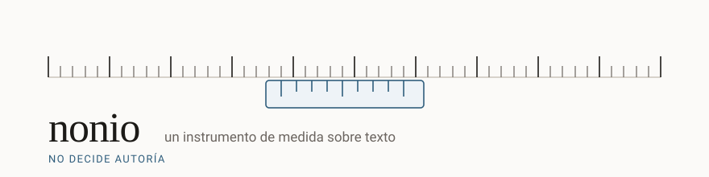

<p align="center">
  
</p>

<p align="center">
  <a href="https://github.com/JoaquinRuiz/nonio/actions/workflows/ci.yml"></a>
  <a href="LICENSE"></a>
  
  
  
  
</p>

<p align="center">
  <b>Nonio estimates statistical signals associated with machine-generated language<br>
  and reports them with their uncertainty. It does not decide authorship.</b>
</p>

---

> ### ⚠️ Read this before anything else
>
> Nonio's output **must not be the sole basis for any academic, employment, or
> editorial decision.**
>
> There is no output that claims a text *"was written by AI"* or *"was written by
> a human"*. What it returns is the value of a set of statistical signals, the
> threshold applied, and the measured error rate of that threshold. Reading that
> as an accusation is a misuse of the tool.
>
> **And right now it is not good enough to use on anyone.** See
> [the numbers](#-the-numbers-so-far).

---

## Contents

- [Why this exists](#-why-this-exists)
- [The numbers so far](#-the-numbers-so-far)
- [Install](#-install)
- [Use](#-use)
- [How it measures](#-how-it-measures)
- [Principles](#-principles)
- [Documentation](#-documentation)
- [Contributing](#-contributing)
- [How it is built](#-how-it-is-built)

---

## 🧭 Why this exists

A *nonio* is the sliding vernier scale on a caliper — the part that gives a
measurement its extra digit of precision. It doesn't decide anything. It tells
you how much, and how finely it can tell.

Existing detectors output things like *"87% AI"*. Students have been failed on
numbers like that, including students who wrote their own work. The number comes
with no error rate, no breakdown, and no way to argue with it.

A thermometer does not tell you that you are ill. It says 38.2 °C, and you
decide. Nonio is built to be a thermometer, and its constraints are enforced by
tests so that it cannot quietly become a judge.

## 📊 The numbers so far

Measured on `qwen2.5-0.5b`, Spanish, ~1,400 corpus cases. Full detail in
[calibration findings](docs/calibration-findings.md).

| | Measured |
|---|---|
| False positives on human prose | **5.3 %** |
| Machine-generated text caught | **47 %** — CI [36 %, 58 %], n=72 |
| Bias against non-native Spanish | 1.30× — CI [0.78, 2.53] → **inconclusive** |
| Speed | 1,000 words in **12 s** median, CPU only, no GPU |
| Corpus | 4 of 5 categories, licence and provenance per case |

Read plainly: **it catches slightly under half of what it looks for, while
wrongly flagging one human text in twenty**, and there is not yet enough sample
to say whether it is unfair to non-native writers.

That is why no default threshold ships and `analyze()` abstains unless you pass a
calibration table explicitly. It is the gate working, not an unfinished state.

## 📦 Install

```bash
git clone https://github.com/JoaquinRuiz/nonio
cd nonio
pip install -e ".[dev]"

nonio download qwen2.5-0.5b   # ~1 GB, the only command that uses the network
nonio check                   # should report the profile as available
```

Python 3.11+.

## 🔬 Use

### A reading

```console
$ nonio analyze essay.md
⚠  Nonio no decide autoría. Esta salida no debe ser base única de ninguna
   decisión académica, laboral o editorial.

fuente: essay.md
perfil: qwen2.5-0.5b   idioma detectado: es
palabras medibles: 308   excluido del cálculo: 0.0%

RESULTADO: señal MODERADO
  umbral aplicado:     0.9167
  falsos positivos:    5.3%  medidos sobre «humano_pre2022»
  cifra reproducible:  sí (corpus público)
  señales:
    binoculars         valor=  -0.8732   percentil=0.836   rango=[-2, 0]
    fast_detect_gpt    valor=  +0.0253   percentil=0.657   rango=[-2, 6]

  tramos que más contribuyen:
    caracteres 410–843     contribución=1.00
    caracteres 1275–1702   contribución=0.71

  desglose por bloque (5):
    [0]      0–408      98 tok  insufficient_evidence (insufficient_length)
    [1]    410–843     104 tok  señal moderado
    ...

  El nivel describe la intensidad de una señal estadística, no quién escribió
  el texto.
```

Every figure arrives with the threshold that produced it and that threshold's
measured error rate. There is no code path that emits one without the other.

### An abstention

```console
$ nonio analyze short-note.txt ; echo "exit=$?"
RESULTADO: insufficient_evidence  (insufficient_length)
  El texto tiene 70 palabras; el mínimo calibrado es 250.

  La abstención es un resultado completo, no un fallo: Nonio no arriesga una
  medida que no se sostiene.
exit=1
```

Four distinct causes: too short, too short *after* excluding code and quotes,
uncalibrated language, and signals contradicting each other.

### Other commands

```bash
nonio analyze essay.md --json                 # structured, with schema_version
nonio analyze essay.md --html -o report.html  # self-contained HTML report
cat essay.md | nonio analyze                  # reads stdin
nonio schema                                  # JSON Schema of the output
nonio profiles                                # available profiles, measured runtimes
nonio eval --corpus public                    # evaluation, always per category
```

<details>
<summary><b>Exit codes</b></summary>

| Code | Meaning |
|---:|---|
| 0 | A reading was produced |
| 1 | Abstention — **the text cannot be measured.** Not a failure. |
| 2 | Usage error |
| 3 | Measurement resource missing |
| 4 | Internal error |

Code 1 is a legitimate, complete result. With `--json` it comes with a valid
document whose `result.type` is `insufficient_evidence`. In a script, treat `1`
as an answer and `2`/`3` as problems.

</details>

<details>
<summary><b>Python API</b></summary>

Every CLI capability exists as an importable function — no capability is
CLI-only, and a contract test walks the command registry to prove it.

```python
import nonio

result = nonio.analyze("essay.md")

match result.result:
    case nonio.Reading() as r:
        print(r.level, r.applied_threshold, r.measured_fpr, r.fpr_category)
    case nonio.Abstention() as a:
        print(a.cause, a.detail)

for block in result.blocks:      # always present
    ...
```

Abstention **never** arrives as an exception; it travels in `result.result`.
Exceptions are reserved for environment conditions — a missing model, an
unreadable input.

</details>

<details>
<summary><b>HTML reports</b></summary>

`--html` writes a self-contained report: no external fonts, no CDN, no remote
images. A report that loaded anything from outside would tell whoever serves that
resource that someone is analysing a text, and Article V exists so neither the
text nor the fact of analysing it leaves your machine.

It is deliberately **not** designed to look like a certificate: the warning comes
before the figure, the error rate sits next to every number, and there are no
seals, signatures, or logos. Article IX forbids exports designed to be attached
to a disciplinary file, and an official-looking document is exactly what gets
printed and attached.

Add your own links to the footer with an `author.json` — see
`author.example.json`.

</details>

## 🧪 How it measures

Two independent signal families, so they fail for different reasons and agreement
between them means something:

| Signal | What it looks at |
|---|---|
| **[Fast-DetectGPT](https://arxiv.org/abs/2310.05130)** | Conditional probability curvature. A sampling-free variant of DetectGPT, which is what makes it viable on CPU. |
| **[Binoculars](https://arxiv.org/abs/2401.12070)** | Ratio of an observer model's perplexity to the cross-perplexity between two sibling models. That denominator measures the text's intrinsic difficulty. |

Binoculars' normalisation is the reason naturally predictable prose — technical
documentation, legal text — is not automatically mistaken for generated text.

Both run in a **single forward pass per model**, accumulating per block.
Materialising full distributions for a 1,500-token document would cost ~900 MB;
this keeps memory bounded and the analysis interactive.

If the two signals contradict each other beyond a margin, Nonio abstains rather
than averaging them into a confident-looking middle.

## ⚖ Principles

Governed by a constitution whose constraints are enforced by tests rather than by
good intentions. The document itself is private — the specification artefacts are,
the fact that they exist is not — but every article below is visible in the code
that enforces it:

| | Principle | Enforced by |
|---|---|---|
| **I** | An instrument, not a judge. No output asserts authorship. | A test walks every path of the output JSON and fails if an authorship key appears — verified by injecting one. |
| **II** | Abstention is a first-class result. | `insufficient_evidence` is a complete answer with a stated cause, never an exception. |
| **III** | Calibration measured and published. | No threshold ships without its per-category false-positive rate. The type system won't let you build a reading without it. |
| **IV** | Every measurement is traceable. | Per-block and per-signal breakdown, with spans over the original text. |
| **V** | Local by default. | A test makes any outbound socket connection raise, and `analyze()` triggers none. |
| **VI** | No capability exists only in the CLI. | A parity test reads the command registry. |
| **VIII** | Spanish first, not extrapolated. | Thresholds belong to a profile and a language; the loader rejects reuse. |
| **IX** | Not a tool for accusation. | No guilt score, no ranking, no batch mode comparing people. |

One consequence worth stating: Nonio measures its **own bias** against non-native
writers, but never tries to detect whether *you* are one. Inferring that would
mean profiling a person, which Article IX forbids. The category exists to hold the
instrument to account, not to classify its users.

## 📚 Documentation

| | |
|---|---|
| [Roadmap](ROADMAP.md) | What comes next — and the conditions under which this project should be abandoned |
| [Calibration findings](docs/calibration-findings.md) | The measured figures, why the gate doesn't pass, and what was deliberately *not* done to make it pass |
| [Known limitations](docs/limitations.md) | Including ones the measurement revealed and that have not been fixed |
| [Getting started](docs/getting-started.md) | From clone to first result |
| [Reproducibility](docs/reproducibility.md) | What a third party can and cannot reproduce |
| [Releasing](docs/releasing.md) | How a version gets published, and what must be true before 1.0 |

## 🤝 Contributing

**The most valuable contribution right now does not involve writing code.**

The corpus needs a category that cannot be faked: text where *a person* rewrote
model output by hand. A model editing a model is a different thing and would
shift every published figure unpredictably.

👉 **[#1 — Populate the `mixto` corpus category](https://github.com/JoaquinRuiz/nonio/issues/1)**

Especially wanted: contributors whose first language is not Spanish. That group is
the one this project exists to protect from false accusation, and the hardest to
represent fairly.

Also genuinely useful: **try to break it.** Feed it your own writing and see if it
flags you. Run a "humanizer" and tell us what happens — we want that documented,
not avoided. A finding that makes Nonio look bad is worth more than one that makes
it look good.

See [CONTRIBUTING.md](CONTRIBUTING.md).

## 🛠 How it is built

Developed **with AI assistance under a specification-first methodology**: the
constitution, specification, plan, and tasks are written and reviewed before the
code.

The specification artefacts are private; the fact that they exist is not. A tool
that measures the fingerprints of automated generation cannot afford for its own
method of construction to look hidden.

**Language note:** documentation and interface are in English; the measurement is
calibrated on Spanish first. Those are different things on purpose — a threshold
measured on English says nothing about Spanish, so Nonio abstains for languages it
has not measured rather than extrapolating.

## 📄 License

Apache-2.0. See [LICENSE](LICENSE).

The evaluation corpus is mixed-licence — Apache-2.0, CC BY-SA, and public domain —
and every case records its own licence and provenance in `corpus/manifest.jsonl`.
